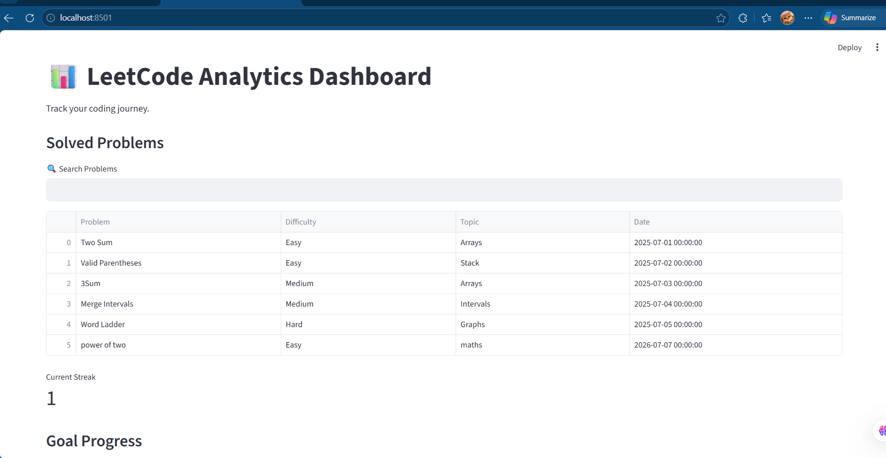
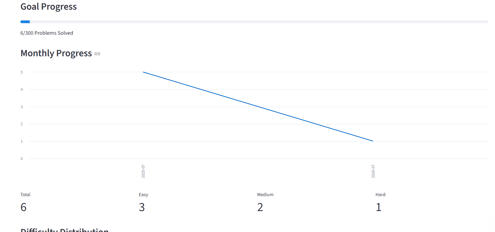
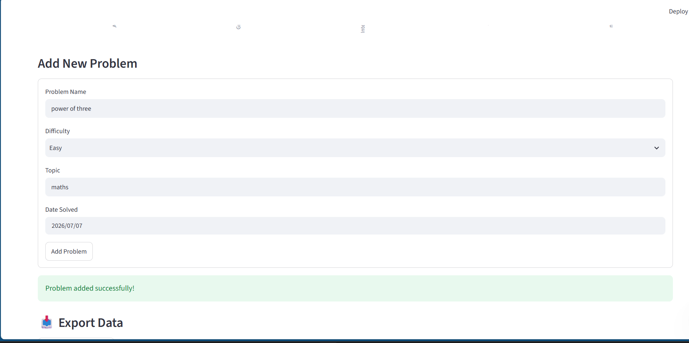

#  LeetCode Analytics Dashboard

A Streamlit-based dashboard that helps track and analyze LeetCode problem-solving progress.

##  Features

* Add solved problems through an interactive form
* Store progress in CSV format
* Search problems instantly
* Difficulty-wise statistics (Easy, Medium, Hard)
* Difficulty distribution chart
* Topic analysis chart
* Solving streak tracker
* Goal progress tracker
* Monthly progress visualization
* Export progress data as CSV

##  Screenshots

### Dashboard



### Analytics



### Add Problem Form



## Tech Stack

* Python
* Streamlit
* Pandas
* Matplotlib
* Git & GitHub

##  Project Structure

```text
Leetcode-Analytics-Dashboard/
│
├── app.py
├── requirements.txt
├── README.md
│
├── data/
│   └── problems.csv
│
└── utils/
    ├── analytics.py
    └── storage.py
```

## Installation

Clone the repository:

```bash
git clone https://github.com/Rima-005/Leetcode-Analytics-Dashboard.git
```

Move into the project folder:

```bash
cd Leetcode-Analytics-Dashboard
```

Install dependencies:

```bash
pip install -r requirements.txt
```

Run the application:

```bash
python -m streamlit run app.py


```


## 📈 Dashboard Features

### Problem Tracking

Add solved LeetCode problems with:

* Problem Name
* Difficulty
* Topic
* Date Solved

### Analytics

* Difficulty distribution
* Topic-wise analysis
* Monthly progress tracking
* Current solving streak
* Goal completion tracking

### Data Export

Download your complete progress history as a CSV file.

##  Future Improvements

* GitHub-style activity heatmap
* Contest analytics
* Placement readiness score
* Advanced filtering and sorting
* Cloud database integration
* User authentication


